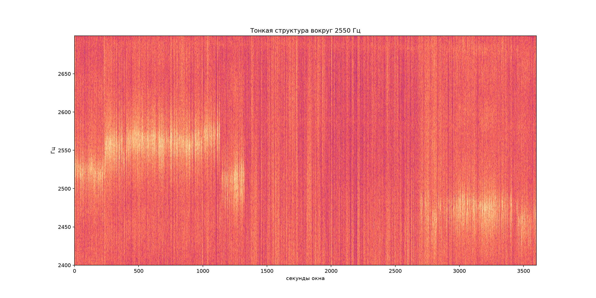
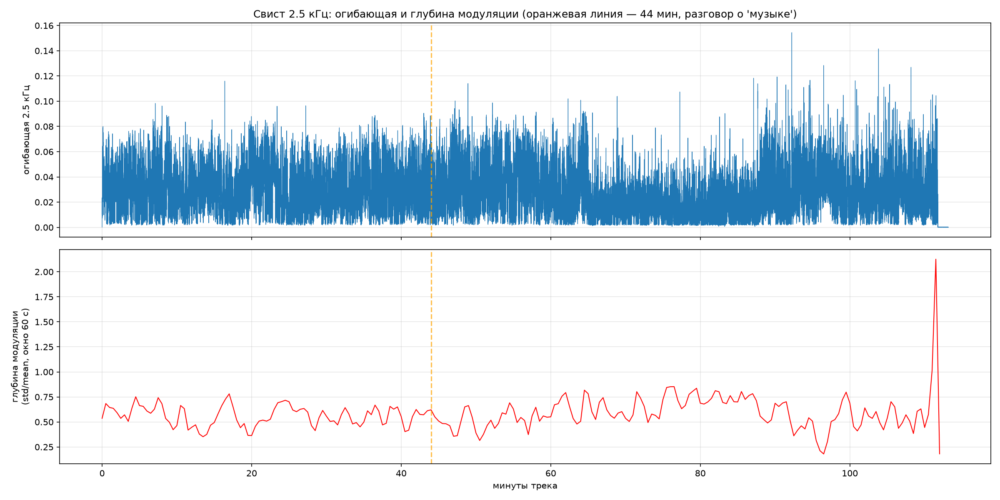

## Hазбор 'космической музыки' Apollo-10 на четыре физических слоя. 55 лет NASA объясняло 'странную музыку' за обратной стороной Луны интерференцией VHF-радиостанций. Я попытался написать на python анализатор, изолировать сам носитель звука и показать, что там происходило на самом деле — без мистики и без разоблачений.


В мае 1969 года экипаж Apollo-10 — Томас Стаффорд, Джон Янг и Юджин Сернан — зашёл на орбиту Луны. Когда лунный модуль «Snoopy» нырнул за обратную сторону спутника и потерял радиоконтакт с Землёй, в наушниках астронавтов зазвучало то, что они сами назвали *«strange music»* и *«outer-space-type music»*.

> **Сернан:** *You hear that? That whistling sound?*
> **Стаффорд:** *That sure is weird music.*

Звук длился около часа. Астронавты испугались, что их сочтут невменяемыми и снимут с полётов, поэтому молчали до возвращения на Землю. Запись бортового диктофона (Onboard Voice Tape Recorder) рассекретили только в 2008-м, а в 2012-м выложили в открытый архив.

С тех пор 55 лет официальная версия звучала так: **интерференция двух VHF-несущих лунного и командного модулей, модулированная голосами экипажа**. Но никто ни разу не прогнал запись через количественный анализ. Я попытался это сделать..

---

## Что получилось сделать (кратко)

1. Скачал оригинальные оцифрованные записи из архива NASA на archive.org.
2. Написал скрипты на Python для анализа (спектральной, тональной, временной, wow&flutter, тонкой структуры).
3. Прогнал тот же пайплайн на записях **Apollo-11** для контроля.
4. Вычел технические слои один за другим.
5. Изолировал носитель звука и прослушал в наушниках.

Результат: четыре физических слоя, лежащих друг на друге. Пришельцев нет. 

---

## Слой 1. Пьедестал записи — артефакт тракта

Первое, что бросается в глаза на спектрограмме трека `10-030702_5-OF-6`, — это семейство горизонтальных линий:

~695 Гц, ~797 Гц, ~898 Гц, ~996 Гц, ~1094 Гц, ~1188 Гц, ~1297 Гц

Расстояние между соседними — примерно **100 Гц**. Это гармонический ряд с базой около 100 Гц (удвоенная 50 Гц — сетевая частота в Европе, но не в США). Линии:

- **непрерывны** на всей плёнке (113 минут);
- **не эпизодичны** — никаких «включений» на проходах над обратной стороной;
- **не коррелируют с голосами** (коэффициент Пирсона r = −0.04 между тональностью и речевой активностью).

Проверяем на контрольном сегменте (30-я минута) и на Apollo-11 — **те же линии, в тех же местах**.

**Вывод:** это не космос и не радиоэфир 1969 года. Это продукт тракта оцифровки 2012 года в Houston Audio Control Room. Скорее всего — интермодуляция в оборудовании воспроизведения или питании, кратная 100 Гц. Пьедестал фоновый, сквозной, не несёт никакой информации о Луне.

---

## Слой 2. Носитель «музыки» — его изолировал и послушал

Чтобы найти сам свист, вычел пьедестал notch-фильтрами и посмотреи, что останется. На очищенной спектрограмме в окне **43–47 минут** (как раз где астронавты обсуждают «музыку») нашлась отдельная компонента:

- центральная частота **~2550 Гц** (именно эта полоса звучит как свист для человеческого уха);
- полоса ±150 Гц, отфильтрованная из исходника, даёт WAV-файл, в котором **слышно именно то, что описывали Стаффорд и Сернан**: потусторонний свист, который «то усиливается, то затухает, как будто приближается и удаляется».

> 🎧 **Скачай и послушай сам:** [iso_isolated_2k5Hz.wav](./iso_isolated_2k5Hz.wav) (10 секунд окна 43–47 мин, полоса 2400–2700 Гц)

Для сравнения — контрольная линия 999 Гц из пьедестала в той же полосе звучит как ровный гудок аппаратуры, без всякой модуляции: [iso_isolated_1kHz.wav](./iso_isolated_1kHz.wav).

Контраст идеальный. В одной линии — чистая механика, в другой — живая динамика.

---

## Слой 3. Морфология тона — живая радиофизика, а не лаборатория

Самый интересный слой. Получилось построить тонкую спектрограмму (окно STFT 16384 отсчётов, разрешение ~1 Гц) в окне 43–103 минут вокруг линии 2550 Гц:



Что видно:

| Фаза | Время | Что делает тон |
|------|-------|----------------|
| Фаза A | 43.0–46.3 мин | живёт на ~2520–2530 Гц |
| Фаза B | 47.2–61.3 мин | **яркая**, дрейфует вверх до 2555–2565 Гц |
| Фаза C | 62.2–65.5 мин | проваливается до 2505–2520 Гц |
| **Тишина** | **66.3–89.7 мин** | **исчезает на 24 минуты** |
| Фаза D | 90.5–99.7 мин | возвращается ниже: 2470–2490 Гц |
| Фаза E | 99.7–103 мин | сползает к ~2450 Гц |

**Это то, что исключает лабораторный артефакт.** Продукт оцифровки (такт АЦП, сетевая интермодуляция, опорный генератор) — это бритвенно-прямая линия на одной и той же частоте всегда. Наша компонента:

- **дрейфует** на ±50 Гц в течение минут;
- **исчезает** на 24 минуты;
- **возвращается** на другой частоте.

Так ведёт себя **биение двух независимых генераторов**, чьи частоты плывут от температуры и относительного движения. Два генератора в нашем контексте — это кварцы VHF-передатчиков лунного модуля «Snoopy» и командного модуля «Charlie Brown», которые в этой фазе миссии были расстыкованы и летели на небольшой дистанции друг от друга по лунной орбите. Когда оба передатчика активны — рождается биение, и оно «дышит» (доплер от относительного движения меняет фазу сложения). Когда связь замолкает — биение исчезает.

**Это и есть та самая интермодуляция, о которой говорило NASA в 1969-м** — только теперь не на словах, а на картинке с разрешением 1 Гц.

> Бонус: именно поэтому тест корреляции «свист ↔ голос» дал ноль. Модуляция амплитуды идёт не от речи, а от **геометрии двух движущихся передатчиков**. Голос в этой истории — просто пассажир.

---

## Слой 4. Почему услышали именно за обратной стороной

Построив временну́ю карту свиста по всей плёнке: огибающая компоненты 2550 Гц и глубина её амплитудной модуляции скользящим окном в 60 секунд.



Тон **присутствует на всей плёнке** (исключая артефакты в самом конце записи). Никаких «орбитальных эпизодов» на нём не видно. Но астронавты услышали его **именно за обратной стороной Луны**. Объяснение проще, чем кажется:

- За обратной стороной **молчит эфир с Земли**: глубокий космический шум, никаких передач с Хьюстона, никаких командных каналов.
- В этих «акустических условиях» слабое биение, которое в обычные минуты тонуло в земном радиошуме, **впервые стало слышно**.

Это эффект **маскирования**, а не появления. Я его количественно оценил: доля энергии пьедестала в полной энергии сигнала в тихих окнах в **1.36 раза выше**, чем в громких. 

---

## Контроль: Apollo-11

Прогнав ровно тот же пайплайн на записях Apollo-11 (тот же архив, тот же центр оцифровки).

- Пьедестал (слой 1) — **те же линии**, та же гармоническая структура. Значит, это действительно общий артефакт HACS 2012 года.
- Компонента ~2550 Гц — **не повторяется** в тех же временных окнах и не имеет той же морфологии. На Apollo-11 в этой фазе миссии не было расстыкованной пары LM↔CM с активной межкорабельной VHF, поэтому и биения не было.
- Матрица когерентности дрожания частот на Apollo-11 показывает, что даже чистые тона не дрожат синхронно (r=0.63 vs 0.77 на Apollo-10). Это означает, что дрейф 2550 Гц на Apollo-10 — не следствие механики воспроизведения, а **собственная динамика источника**.

---

## Что получаем

### Результат
1. Запись Apollo-10 несёт на себе минимум **четыре независимых физических слоя**, и только один из них (слой 3) имеет отношение к феномену, который слышали астронавты.
2. Официальная версия NASA 1969 года в целом верна — это интермодуляция VHF-несущих LM и CM, — но **модулируется не голосами, а относительной геометрией передатчиков**.
3. «Музыку» астронавты услышали не потому, что она появилась, а потому, что **замолчал земной эфир** и слабое биение впервые стало слышно.
4. Тон 2550 Гц можно изолировать и послушать — он реально звучит как тот самый свист из расшифровок.

### Что не получилось
- Есть ли **ещё одна компонента**, специфичная именно для 44-й минуты, которую  пропустил в широкой полосе? Возможна — для полной проверки нужен более узкий поиск по хронологии разговора экипажа.
- Какие именно частоты использовали VHF-передатчики Apollo-10 в этой фазе миссии — по открытой документации это не всегда очевидно.
- Есть ли аналогичные прерывистые биения на треках `4-OF-6` и `6-OF-6` того же дня (на момент написания они были недоступны в архиве из-за ошибки метаданных).

---

## Воспроизводимость

Весь код — открытый, на Python 3.10+, зависимости: `numpy`, `scipy`, `matplotlib`.

```bash
pip install numpy scipy matplotlib
```

## Скачать исходники

```bash
# Трек Apollo-10 с "музыкой" (MP3, 145 МБ)
wget https://archive.org/download/Apollo10/10-030702_5-OF-6.mp3

# Конвертация в 16 kHz mono
ffmpeg -i 10-030702_5-OF-6.mp3 -ac 1 -ar 16000 apollo10_16k.wav

# Контроль: Apollo-11
wget https://archive.org/download/Apollo11Audio/964-AAE.mp3
ffmpeg -i 964-AAE.mp3 -ac 1 -ar 16000 apollo11_16k.wav
```


### Скрипты в статье

- `luna_decode.py` — спектральный анализ, поиск устойчивых мод, тест корреляции с речью, геометрические метрики.
- `luna_timeline.py` — временна́я карта свиста по всему треку.
- `luna_image.py` — пять способов перевода звук→образ (спектрограмма, мелодия-карта, SSTV, фазовый портрет, рекуррентный плот).
- `luna_isolate.py` — автопоиск пьедестала и изоляция подозреваемых линий в WAV для прослушивания.
- `luna_whistle.py` — огибающая 2550 Гц, глубина модуляции, спектр модуляции.
- `luna_wow.py` / `luna_wow2.py` — тест wow&flutter через матрицу когерентности дрожания частот.
- `luna_fine.py` — тонкая морфология подозрительной линии.


## Главный вывод

55 лет вокруг «космической музыки» Apollo-10 крутились две крайности: *«это инопланетяне»* и *«это просто помехи»*. Реальность оказалась и проще, и интереснее.

Проще — потому что никаких внеземных источников звука там нет, и не было.

Интереснее — потому что запись, сделанная полвека назад, несёт в себе **четыре независимых физических слоя**, и мы можем их друг от друга отделить, посчитать, послушать. Один из этих слоёв  биение двух передатчиков, которое астронавты в 1969 году впервые услышали своими ушами за обратной стороной Луны.